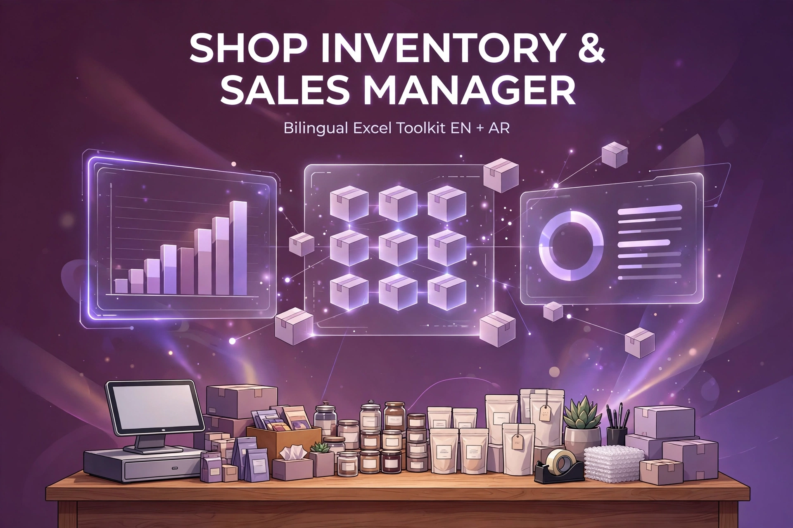

# Shop Inventory & Sales Manager — Bilingual Excel Toolkit (EN + AR)

Stop losing track of what's on your shelves. The complete stock + sales system for small shops, resellers, and online sellers — one Excel workbook that knows every product, every sale, and every dollar of profit.

## What's inside

Two workbooks (English + Arabic RTL), 8 sheets each:

| Sheet | What it does |
|---|---|
| Setup | Business name, currency, low-stock threshold, categories, channels |
| Dashboard | Revenue, COGS, gross profit, expenses, net profit, units sold, stock value, low-stock count + charts |
| Products | SKU catalog with cost/selling price and auto margin % |
| Stock In | Purchases & restocks log |
| Sales | Sales log with discounts, channels, auto cost lookup |
| Expenses | Expense log with categories |
| Inventory | **Live** per-SKU stock with color-coded OK / LOW — Reorder / OUT OF STOCK alerts |
| Invoice | Invoice generator — pick SKUs, set tax, print |

## Why it beats the apps

- **One-time $24** — not $99/year like the budgeting apps
- No subscriptions, no cloud lock-in — your data stays yours
- **Arabic RTL version included**
- No macros, no add-ins — works in Microsoft Excel (desktop & web)

## Get it

This is a commercial product — the workbooks are delivered instantly after purchase:

- 🛒 [Buy on SellApp — $24 (USDT)](https://digitaltoolkitstore.sell.app/product/shop-inventory-sales-manager-bilingual-excel-toolkit-en-ar)
- 🛒 [Buy on Getly — $24](https://www.getly.store/product/shop-inventory-sales-manager-bilingual-excel-toolkit-en-ar)
- 🏬 [Digital Toolkit Store](https://www.getly.store/store/quoteguard-mtg2lwr7)

Commercial license: use it for your own business or your clients' businesses.
